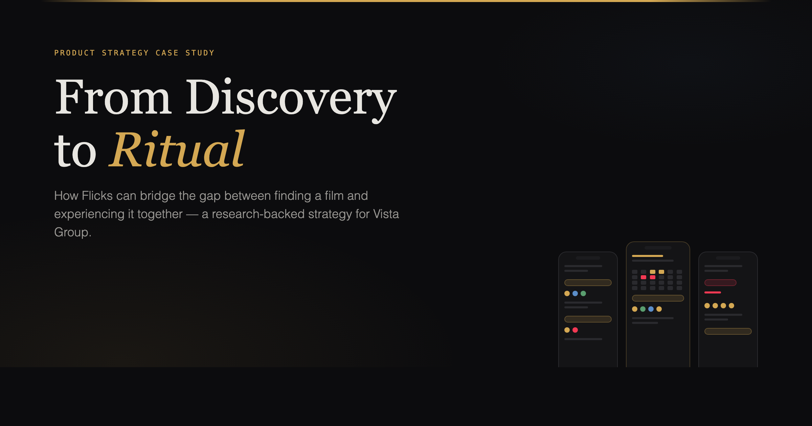

<picture>
  
</picture>

# From Discovery to Ritual

**A research-backed product strategy for [Flicks](https://www.flicks.co.nz/) — Vista Group's cinema discovery platform.**

This case study argues that Flicks can transform from a film discovery tool into the platform that makes going to the cinema frictionless and social — by owning the coordination and post-viewing phases of the moviegoing journey. Three interconnected feature proposals, collectively called **Cinema Together**, are scoped to Flicks' current technical reality, grounded in peer-reviewed research, and tied directly to Vista Group's commercial ecosystem.

 

### The Argument

Cinema is competing on experience, not convenience. The research shows that **personal recommendation from close friends is the single strongest predictor of attendance** — yet on every existing platform, that signal is invisible at the moment of decision. Flicks currently excels at *discovery* and *showtimes*, but the journey's most valuable phase — coordination, attendance, and post-film engagement — happens entirely outside the platform.

Cinema Together closes that gap through three features:

| | Feature | What It Does | Vista Ecosystem Link |
|---|---------|-------------|---------------------|
| **01** | **Social Signals** | Surfaces friend interest on films and showtimes — quiet badges, avatar stacks on session pills, "Join" prompts | Movio Cinema EQ — social graph feeds propensity models across 100M+ profiles |
| **02** | **Who's In?** | Lightweight invite → RSVP → seat coordination flow, with proximity-aware booking | Vista Cloud — group bookings at 3–4x yield flow through ticketing & payments |
| **03** | **Quick Capture** | Post-film emoji reaction → star rating → viewing diary, prompted 2hrs after showtime | React + Horizon — extends Vista's exhibitor survey infrastructure to consumers |

Each feature feeds the next. A recommendation from Quick Capture becomes a Social Signal for someone else. A Social Signal triggers a Who's In invitation. The loop compounds.

 

### The Prototypes

Every proposal is backed by an **interactive prototype** — nine screens across three features, built as a React 19 + TypeScript application at production fidelity.

<table>
<tr>
<td align="center" width="33%"><strong>Social Signals</strong> 1A Showtimes · 1B Film Detail · 1C Friends' Sessions</td>
<td align="center" width="33%"><strong>Who's In?</strong> 2A Seat Selection · 2B Invite Friends · 2C RSVP Tracker</td>
<td align="center" width="33%"><strong>Quick Capture</strong> 3A Notification · 3B Emoji Reaction · 3C Viewing Diary</td>
</tr>
</table>

> **[Explore the live prototypes →](https://brunohart.github.io/flicks-case-study/)**
>
> Source: [`brunohart/flicks-case-study`](https://github.com/brunohart/flicks-case-study)

 

### Research Foundation

The strategy draws on:

- **Voronin (2025)** — Social influence as predictor of cinema attendance (*Poetics*)
- **Tefertiller et al. (2019)** — FoMO, social capital, and cinema attendance (*Mass Communication and Society*)
- **DeFelice & Porter (2024)** — Social word-of-mouth patterns for theatrical vs. streaming releases (*Convergence*)
- **DeFelice (2025)** — Media substitution and theatrical brand equity post-pandemic (*Convergence*)
- **Fandango (2025)** — Moviegoing Trends study, 5,000+ respondents
- **Cinema United (2025)** — Theatrical exhibition industry metrics
- **Vista Group (2025)** — H1 financial results; public product roadmap

Full citations are included in the case study document.

 

### Why This Matters for Vista

Vista Group holds **46% global market share** in large-circuit cinema management. 5,500+ cinemas across 116 countries run on Vista infrastructure. Flicks sits at the consumer edge of this ecosystem — every improvement to its ability to convert discovery into attendance drives value across Vista Cloud, Movio, and Horizon.

Cinema Together positions Flicks not as a content guide, but as **the demand generation layer** for Vista's entire B2B cinema stack.

 

### View the Case Study

> **[Read the full strategy document →](https://brunohart.github.io/flicks-rationale-for-case-study/)**

 

---

Bruno Hart · [designedbybruno.net](https://designedbybruno.net) · February 2026
